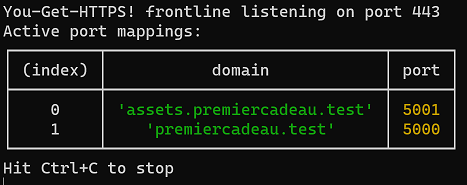

# You Get HTTPS!

You-Get-HTTPS is a trusted-cert HTTPS frontliner for your local development servers.

<!-- FIXME BADGES (package version, npm stats, coding style, CI build status, deps up-to-date, deps vulns…) -->


You can use it to obtain a no-warnings, trusted local HTTPS frontliner for **any local dev servers** you may have, **mapping domains over the local ports** of these servers.  The URL's FQDN is passed along, with HTTPS protocol info, to the proxied service.

As this is a thin wrapper over the amazing [devcert](https://github.com/davewasmer/devcert#readme) tool, you automagically get all the goodness from devcert, including:

- **Automatic trusted local CA creation** and systemwide installation.
- **Automatic certificate creation** for any domain you configure, and all their subdomains, using that trusted CA.
- Automatic configuration of extra trust requirements for **Chrome Linux** and **Firefox**, when applicable.

## Why not just use devcert / mkcert directly?

- [mkcert](https://github.com/FiloSottile/mkcert#readme) is great at installing a trusted local CA and issuing certs for domain lists, but it stops there: **you don't get an HTTPS endpoint with that** cert, you need to either configure each of your local servers to go HTTPS on its own, or write your own frontline.
- [devcert](https://github.com/davewasmer/devcert#readme) is absolutely awesome — which is why this tools sits on top of it — but **you still need to write a frontline using its API** to get a working HTTPS endpoint, typically over your existing Node server code, or with a bit more work, as a proxy over listening ports for dev servers you already have.  Providing that frontline is precisely what You-Get-HTTPS does, to save you the hassle.

## 1. Installation

```bash
npm install --global you-get-https
```

The first time you'll run the tool, the underlying `devcert` will setup and install the trusted local CA.  This requires the availability, in your PATH, of **OpenSSL**.

If you are on **Windows** and do not have OpenSSL installed, [use this link](https://slproweb.com/products/Win32OpenSSL.html) to download the latest build and add its installed `bin` directory to your `PATH`.

Installing a trusted CA on your system often comes with a security prompt. For instance, on a French Windows 10 this may look like this:


## 2. Configuration

The configuration lives in a `you-get-https.json5` file in your `XDG_CONFIG_HOME` (or by default, `.config` directory in your user profile's home directory). The file is [JSON5](https://json5.org/) so you can, for instance, sprinkle comments in there, forego unnecessary key quoting and use trailing commas.

You specify your domain mappings through the `mappings` setting.  Keys are domain names and values are port numbers. Here's an example:

```js
{
  mappings: {
    // Masterclass project
    "assets.masterclass.test": 3001,
    "masterclass.test": 3000,

    // PremierCadeau project
    "assets.premiercadeau.test": 5001,
    "premiercadeau.test": 5000,
  }
}
```

### A word about mapping precedence

Subdomains are automatically mapped to their suffixes, and the more specific (longer) domain suffixes always win the mapping, regardless of their order in the configuration.

## 3. Running You-Get-HTTPS

### Frontline listening port

Unless you're going for a custom port above 1024, **the default HTTPS port (443) may require administrator privileges** for binding.

On **Linux** (including [WSL](https://docs.microsoft.com/en-us/windows/wsl/about)) or **OSX**, this means you need to `sudo` it.

On **Windows**, if you're running it from a command line (Command Prompt, Powershell, etc.) and hitting a port security issue that cannot be solved with a dynamic prompt confirmation, you need to **start that command line as Administrator**.  If you're running it through a shortcut file or direct call, this needs to be configured as Administrator or invoked with that specific mode.

Should that be an issue, you can configure a different frontline listening port, but you'll need to be explicit baout it in your URLs then:

```js
{
  frontline: {
    // Results in e.g. https://premiercadeau.test:1337/
    // Does not require admin privileges to bind.
    listen: 1337
  }
}
```

Once launched, you'll get a successful report looking like this:



### “devcert password”

On Windows, `devcert` ciphers its local root CA credentials for extra security.  Every time you run it with no-certificate-yet domains, it will prompt you for said password.  That password is first set on the very first run, when the local root CA is installed, so be sure to remember it!

## License

This tool is © 2020 Christophe Porteneuve & Delicious Insights, and is provided under the [MIT license](./LICENSE.md).

## Contributing

Would you like to help? Awesome! I'm still formalizing a contribution strategy and trying to make it as easy as possible for everyone, but for now feel free to [fork](https://github.com/deliciousinsights/you-get-https/fork), add your stuff and send a PR!
